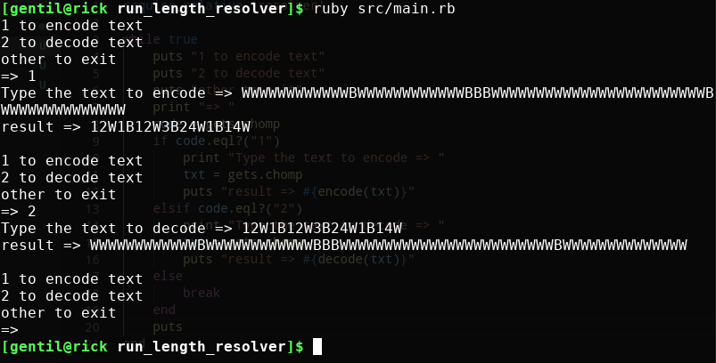

# Run Length Encode (RLE) [Exercício]

Exercício proposto por [Acidiney Dias](https://github.com/acidiney)

* Veja o post original no grupo [Programadores em Angola](https://www.facebook.com/groups/Programadores.Angola/permalink/2279972112238372/)
* Sobre o exercício: https://en.wikipedia.org/wiki/Run-length_encoding

Resolvido por: [Gentil Pinto](https://github.com/GentilPinto)



## Como testar

```
git clone https://github.com/GentilPinto/run_length_resolver.git
cd run_length_resolver
ruby src/main.rb
```